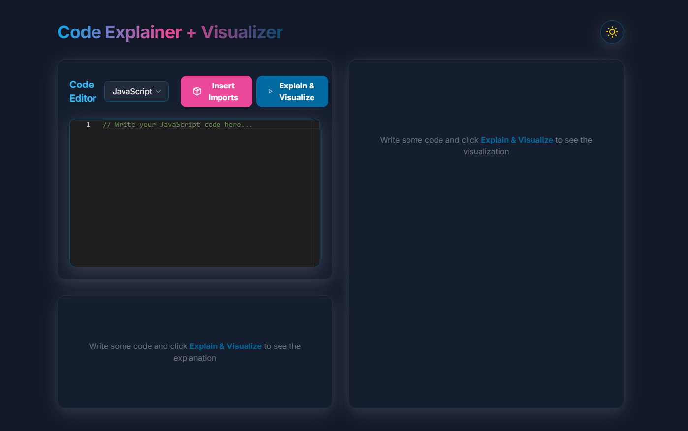
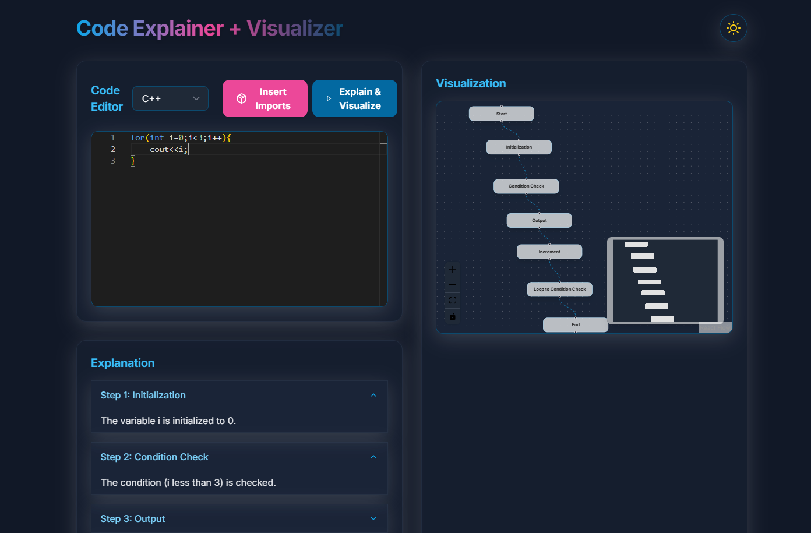
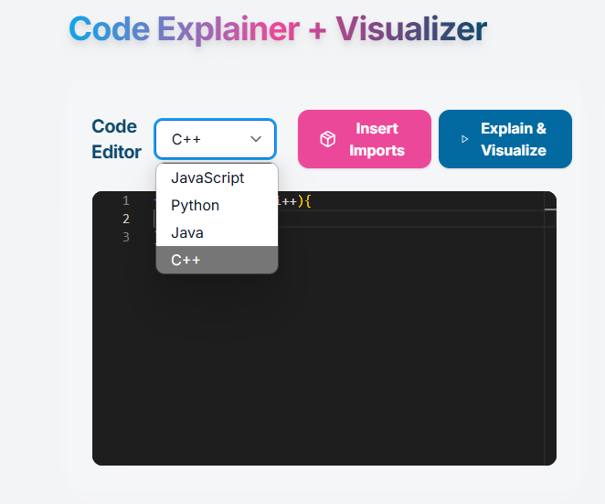
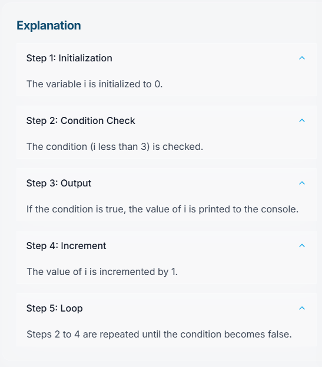

# 🚀 AI Code Explainer & Visualizer

Created a full-stack code explanation and visualization application using **OpenAI**. Through an integrated code editor, users can enter code in **multiple languages** with automatic library imports. The app **explains and visualizes** the code to help users understand it clearly and effectively.
---

## 📌 Table of Contents

- [Demo](#-demo)
- [Features](#-features)
- [Tech Stack](#-tech-stack)
- [Project Structure](#-project-structure)
- [Getting Started](#-getting-started)
- [Environment Variables](#-environment-variables)
- [Deployment](#-deployment)
- [Screenshots](#-screenshots)
- [Contributors](#-contributors)

---

## 🌐 Demo

**Live Applicaction**: [https://frontend-ai.netlify.app](https://frontend-ai.netlify.app/)


---

## ✨ Features

- 🧠 AI-Powered Code Explanation
- 🔎 Step-by-Step Code Execution
- 📊 Interactive UI with clear animations
- 🌐 Full-stack Architecture (React + Express + Node)
- ⚙️ Environment-safe, deployable & scalable

---

## 🛠 Tech Stack

**Frontend**
- React.js
- TailwindCSS
- Axios

**Backend**
- Node.js
- Express.js
- OpenAI API

**Deployment**
- Render (Backend)
- Netlify (Frontend)

---

## 🗂 Project Structure

AI-HACKATHON/
│
├── client/ # React Frontend
│ ├── public/
│ ├── src/
│ │ ├── components/
│ │ ├── utils/
│ │ └── App.js
│ └── package.json
│
├── server/ # Express Backend
│ ├── app.js
│ └── package.json
│
├── .env
└── README.md


---

## 🧩 Getting Started

### 1. Clone the repository

```bash
https://github.com/shashankmomula/FRONTEND-AI.git
cd FRONTEND-AI
```

---

## 🛠️ Installation

### Backend

```bash
cd server
npm install
```

### Frontend

```bash
cd client
npm install
```

# 🚀 Deployment

## 🖥 Backend (Render)

1. Go to [Render](https://render.com)
2. Create a new **Web Service**
3. Set the following:

   - **Root Directory**: `server`
   - **Build Command**: `npm install`
   - **Start Command**: `node app.js`
   - **Environment Variables**:  
     ```env
     PORT=5000
     OPENAI_API_KEY=your_openai_key
     ```

4. Deploy and wait for it to go live.  
   Example Backend URL: `https://your-backend.onrender.com`

---

## 🌐 Frontend (Netlify)

1. Push your code to GitHub
2. Go to [Netlify](https://netlify.com)
3. Create a new site from Git
4. Set the following:

   - **Build Command**: `npm run build`
   - **Publish Directory**: `client/build`

5. Deploy and get the live site URL.  
   Example Frontend URL: `https://your-frontend.netlify.app`

---

# 📸 Screenshots








---

# 👥 Contributors

- **M. Shashank**  
  [GitHub](https://github.com/shashankmomula)  
  [LinkedIn](https://www.linkedin.com/in/momula-shashank-92a2a925a/)

- **Hackathon Team Members**
  - M. SHASHANK 
  

---

